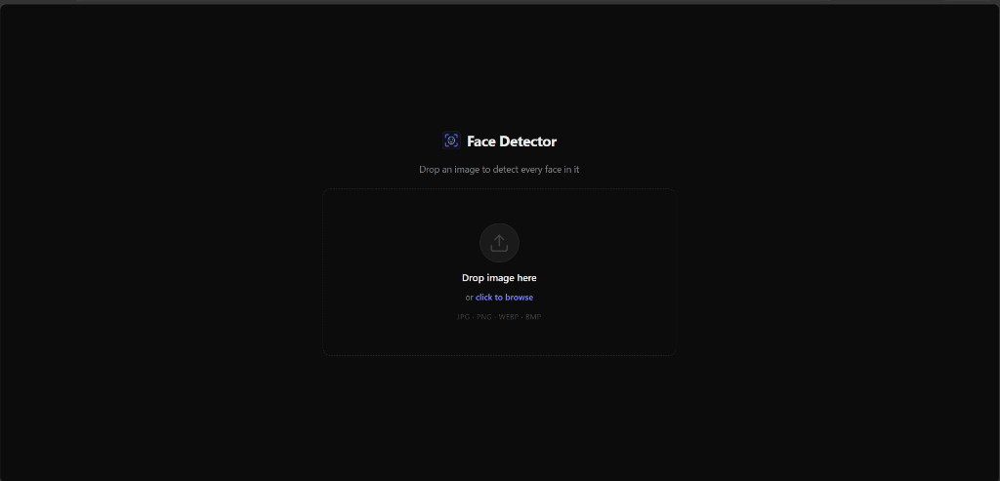
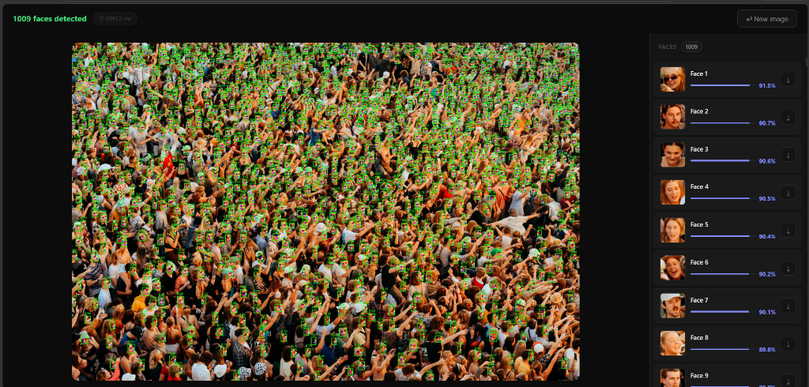

# Face Detector (SCRFD-10G)

A high-recall, production-ready face detection pipeline built on InsightFace's SCRFD-10G ONNX model. Features a two-stage detection architecture with sliding-window tiling for ultra-dense crowds, sub-millisecond geometric landmark validation, and an interactive dark-themed web interface with built-in Ngrok tunneling.

---

## Interface & Results

### Upload Interface
The minimalist web frontend allows drag-and-drop or file browser uploads supporting JPG, PNG, WEBP, and BMP formats.



### Dense Crowd Detection
Tested on massive crowd scenes: detecting over 1,000 faces in a single high-resolution image with sub-millisecond geometric validation and individual high-definition face crops.



---

## Key Highlights

- **Two-Stage Detection Pipeline**:
  - **Stage 1 (SCRFD-10G)**: Tuned for high recall (`det_thresh = 0.35`) to ensure distant, small, and partially occluded faces are proposed.
  - **Stage 2 (Geometric Validator)**: Microsecond-level structural gate filtering non-face artifacts based on 5-point facial landmark geometry, head tilt, and profile perspectives.
- **Sliding-Window Tiling**:
  - Automatically slices high-resolution images into overlapping 640x640 tiles with 20% margin to prevent edge truncation.
  - Simultaneously runs an unconditional global pass to ensure close-up portraits and large foreground subjects are never missed.
- **Profile & Tilted Head Support**:
  - Geometric validator accommodates yaw angles (profiles) and head roll/pitch with adaptive vertical tolerance and foreshortening checks.
- **Client & Network Optimized**:
  - Client-side canvas pre-scaling prevents multi-megabyte network bottlenecks over remote tunnels.
  - Payload compression and diagnostic logging ensure responsive remote interaction.
- **Single-Command Remote Tunneling**:
  - Integrated Ngrok Python SDK support for generating public shareable URLs without complex port forwarding.

---

## Architecture Overview

```
Input Image
    │
    ├──> Downscale to max dimension (default: 2560px)
    │
    ├──> Global Full-Image Inference (SCRFD-10G)
    │
    ├──> Sliding-Window Tiling (if resolution > 1280px)
    │       └── 640x640 tiles with 20% overlap
    │
    ├──> Cross-Tile Non-Maximum Suppression (NMS, IoU = 0.45)
    │
    └──> Stage 2 Geometric Validator (< 1 ms per candidate)
            ├── Layer 1: Minimum pixel dimension check
            ├── Layer 2: Aspect ratio boundary check (0.4 - 2.8)
            ├── Layer 3: 5-point landmark geometry (tilt & profile aware)
            ├── Layer 4: Final confidence floor (0.50)
            └── Layer 5: Deduplication NMS (IoU = 0.40)
                    │
                    ▼
            Validated Bounding Boxes, Landmarks & Crops
```

---

## Model Specifications

| Parameter | Specification | Details |
| :--- | :--- | :--- |
| **Model** | SCRFD-10GF | Bundled in InsightFace `buffalo_l` pack |
| **Format** | ONNX Runtime | Optimized for CPU and CUDA execution |
| **Parameters** | ~3.86 Million | Lightweight mobile/edge architecture |
| **Computational Cost** | ~10 GFLOPs | Measured at 640x640 resolution |
| **Model Disk Size** | 16.9 MB (`det_10g.onnx`) | Downloaded automatically on first initialization |
| **Runtime Memory (RAM)** | ~150 MB - 300 MB | Highly efficient memory footprint |
| **Typical Latency (CPU)** | 30 ms - 70 ms per 640x640 frame | Intel i5 / AMD Ryzen 5 class hardware |
| **Typical Latency (GPU)** | 4 ms - 10 ms per 640x640 frame | NVIDIA GTX / RTX accelerators |

---

## Project Structure

```
FaceDetector/
├── assets/                       # Documentation screenshots
│   ├── upload_interface.png
│   └── detection_results.png
├── face_detection/               # Core detection Python module
│   ├── __init__.py
│   ├── config.py                 # Central configuration and thresholds
│   ├── loader.py                 # Safe image loading and decoding
│   ├── tiling.py                 # Sliding-window tiling and coordinate remapping
│   ├── postprocess.py            # Non-Maximum Suppression (NMS)
│   ├── validator.py              # 5-layer geometric validator
│   ├── utils.py                  # Landmark drawing and annotation helpers
│   ├── models/
│   │   ├── __init__.py
│   │   └── scrfd.py              # SCRFD wrapper around InsightFace
│   └── tests/                    # Unit test suite
│       ├── test_loader.py
│       ├── test_tiling.py
│       ├── test_validator.py
│       └── test_postprocess.py
├── app/                          # Flask web server and frontend
│   ├── __init__.py
│   ├── server.py                 # REST API endpoints and static serving
│   └── static/
│       ├── index.html            # Web UI layout
│       ├── style.css             # Dark theme design system
│       ├── main.js               # Client upload, canvas pre-scaling, and rendering
│       ├── favicon.svg           # Vector branding icon
│       ├── favicon.png
│       └── favicon.ico
├── requirements.txt              # Production dependencies
├── run.py                        # Local runner script
└── main.py                       # Ngrok tunnel + server entry point
```

---

## Installation

### 1. Prerequisites
- Python 3.9, 3.10, or 3.11
- Windows, macOS, or Linux

### 2. Clone and Setup Environment
```bash
git clone <repository-url>
cd FaceDetector

python -m venv .venv

# On Windows (PowerShell):
.\.venv\Scripts\Activate.ps1

# On Linux / macOS:
source .venv/bin/activate
```

### 3. Install Dependencies
```bash
pip install --upgrade pip
pip install -r requirements.txt
```

> Note: On the initial run, InsightFace will automatically download the `buffalo_l` model weights (~280 MB bundle containing `det_10g.onnx`) into `~/.insightface/models/`.

---

## Running the Application

### Option A: Local Web Server
To run locally on `http://127.0.0.1:5000`:
```bash
python run.py
```
Optional arguments:
```bash
python run.py --port 8080 --host 0.0.0.0 --debug
```

### Option B: Remote Public Access (Ngrok Tunnel)
To create a public HTTPS tunnel with a shareable URL:

1. Set your Ngrok authtoken in PowerShell:
   ```powershell
   $env:NGROK_AUTHTOKEN = "YOUR_TOKEN_HERE"
   ```
   Or set it in a `.env` file in the project root:
   ```env
   NGROK_AUTHTOKEN=YOUR_TOKEN_HERE
   ```
2. Start the tunnel and server:
   ```bash
   python main.py
   ```
   Alternatively:
   ```bash
   python run.py --ngrok
   ```

The script will automatically establish the tunnel and print the public URL:
```
=======================================================
  Public ngrok URL:  https://your-domain.ngrok-free.app
  Local server:      http://127.0.0.1:5000
=======================================================
```

---

## Python API Usage

You can also import and use the detector directly within your own Python scripts:

```python
import cv2
from face_detection import FaceDetector, DetectorConfig

# Configure detector settings
cfg = DetectorConfig(
    device="cpu",             # Use "cuda:0" for GPU acceleration
    use_tiling=True,          # Enable sliding-window tiling for large images
    max_image_size=2560,      # Prevent excessive tiling on ultra-high resolutions
    final_confidence=0.50     # Confidence threshold for distinguishable faces
)

detector = FaceDetector(config=cfg)

# Load image using OpenCV
image = cv2.imread("crowd.jpg")

# Run detection
faces = detector.detect(image)

print(f"Detected {len(faces)} faces.")
for i, face in enumerate(faces):
    x1, y1, x2, y2 = face["bbox"]
    score = face["confidence"]
    landmarks = face["landmarks"]
    print(f"Face #{i+1}: Bounding Box=({x1}, {y1}, {x2}, {y2}), Confidence={score:.2%}")
```

---

## Configuration Reference

All settings can be customized in `face_detection/config.py` via `DetectorConfig`:

| Setting | Default | Description |
| :--- | :--- | :--- |
| `model_name` | `"buffalo_l"` | InsightFace model bundle name. |
| `device` | `"cpu"` | Execution backend: `"cpu"`, `"cuda:0"`, etc. |
| `max_image_size` | `2560` | Caps the longest dimension before tiling to bound worst-case latency. |
| `det_thresh` | `0.35` | Initial SCRFD recall threshold. Intentionally low to maximize proposals. |
| `use_tiling` | `True` | Enables sliding-window tiling for small/distant faces. |
| `tile_size` | `640` | Dimension of square tiles (matches model training resolution). |
| `tile_overlap` | `0.20` | Fractional overlap between adjacent tiles to prevent split faces. |
| `tiling_threshold_px` | `1280` | Images below this dimension bypass tiling and run directly. |
| `min_face_px` | `12` | Minimum allowed width and height for a candidate face. |
| `aspect_ratio_min` | `0.40` | Minimum bounding box aspect ratio ($H/W$). |
| `aspect_ratio_max` | `2.80` | Maximum bounding box aspect ratio (allows profile poses). |
| `final_confidence` | `0.50` | Stage 2 confidence floor for retained faces. |
| `nms_iou_final` | `0.40` | IoU threshold for the final deduplication pass. |

---

## Running Automated Tests

Run the test suite using `pytest`:
```bash
pytest face_detection/tests
```
Tests validate:
- Image loader handling of valid, invalid, and corrupt file inputs.
- Sliding-window tile generation, boundaries, and overlap correctness.
- Stage 2 validator layers across synthetic frontal, profile, tilted, and invalid geometries.
- Cross-tile and final NMS deduplication logic.

---

## License

This project is licensed under the MIT License.
